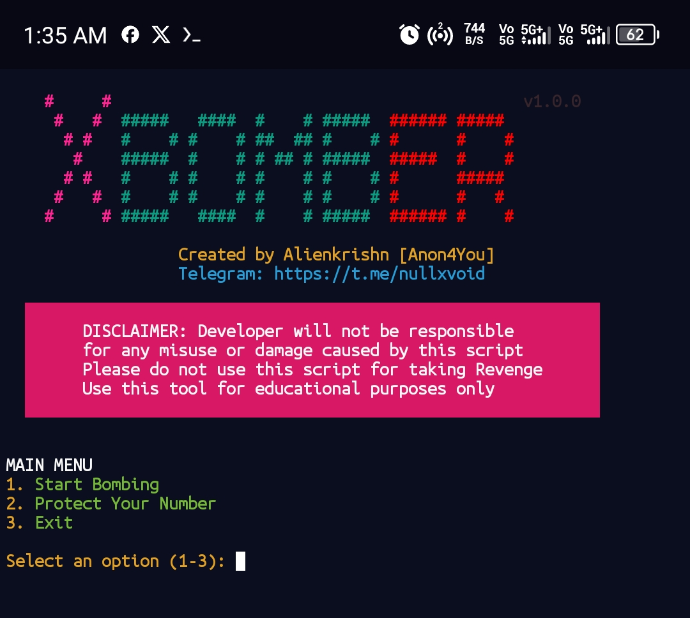

# XBomber



A simple SMS bomber script designed to send multiple SMS messages to a target number. **Use responsibly and only with consent.** This tool is for educational purposes only, and misuse may violate laws or terms of service.

## Requirements

- **Termux App**: Install the Termux app on your Android device from [F-Droid](https://f-droid.org/en/packages/com.termux/) or the [Google Play Store](https://play.google.com/store/apps/details?id=com.termux).
- **Python**: Ensure Python is installed in your Termux environment. Install it using:
  ```bash
  pkg install python
  ```

## Installation

1. Clone the repository:
   ```bash
   git clone https://github.com/Anon4You/XBomber.git
   ```
2. Navigate to the project directory:
   ```bash
   cd XBomber
   ```
3. Make the script executable:
   ```bash
   chmod +x xbomber.sh
   ```

## Usage

Run the script using the following command:
```bash
./xbomber.sh
```

Follow the on-screen prompts to enter the target phone number and other required details.

## Disclaimer

This tool is intended for **educational purposes only**. Unauthorized use of SMS bombers to harass or spam individuals is illegal and unethical. The developer is not responsible for any misuse or damage caused by this script. Always obtain explicit consent before testing on any phone number.

## License

This project is licensed under the MIT License. See the [LICENSE](LICENSE) file for details.

---

**Note**: Always ensure compliance with local laws and regulations when using tools like this. Misuse can lead to legal consequences.
